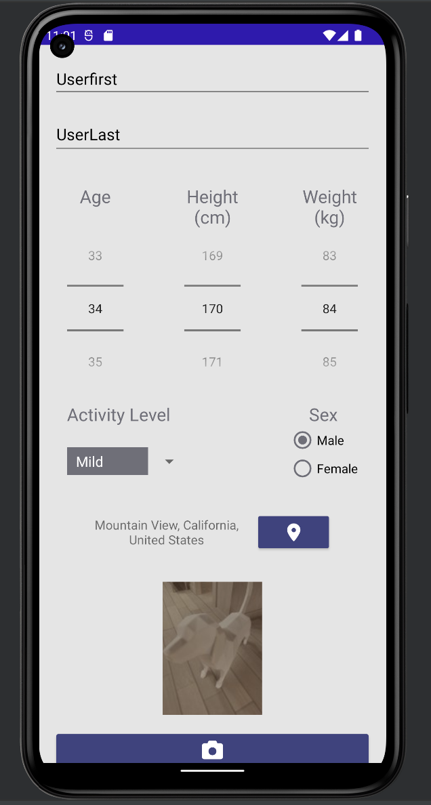
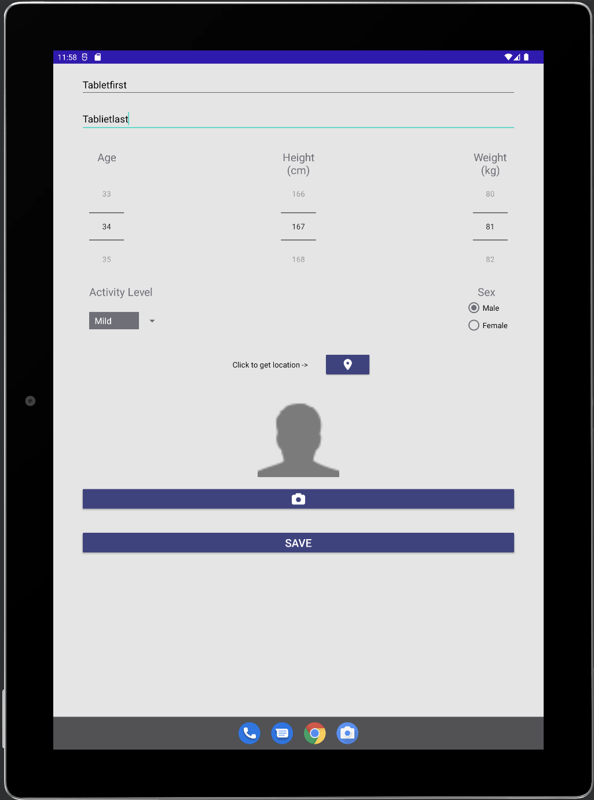
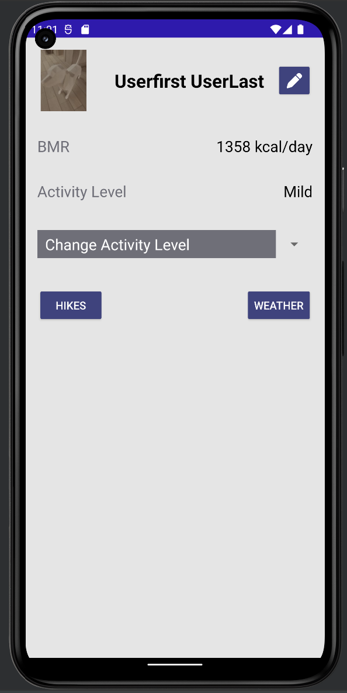
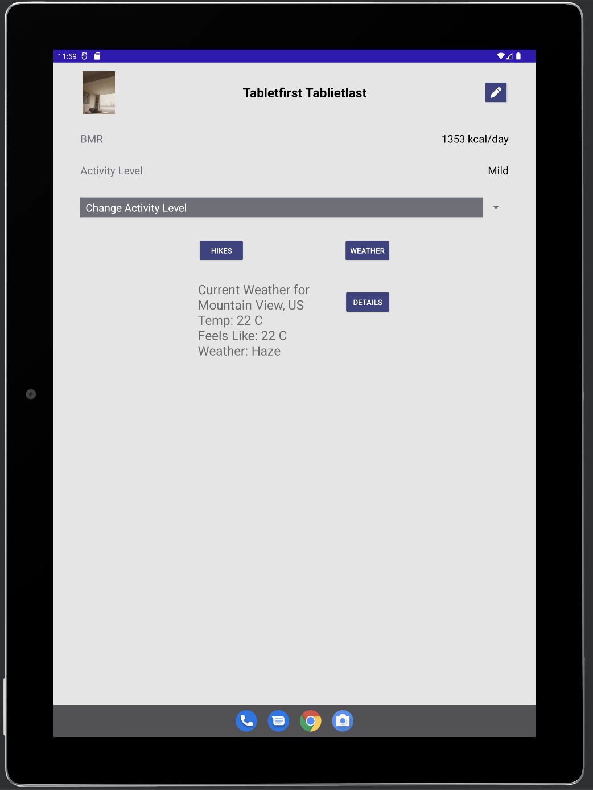
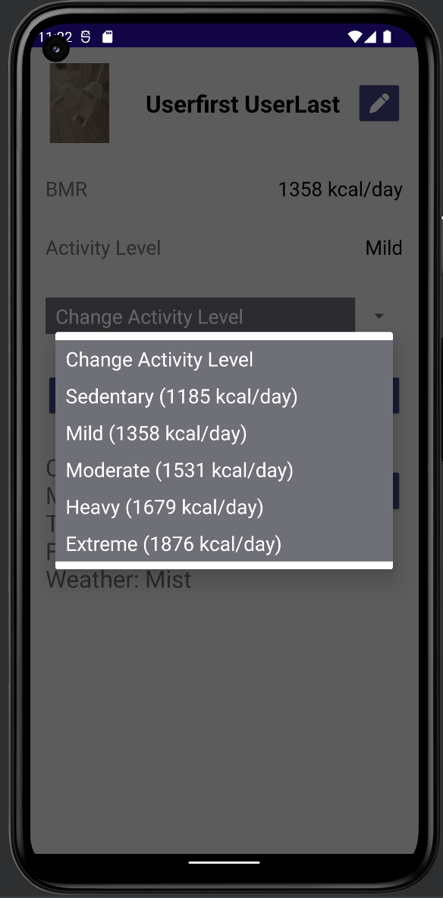
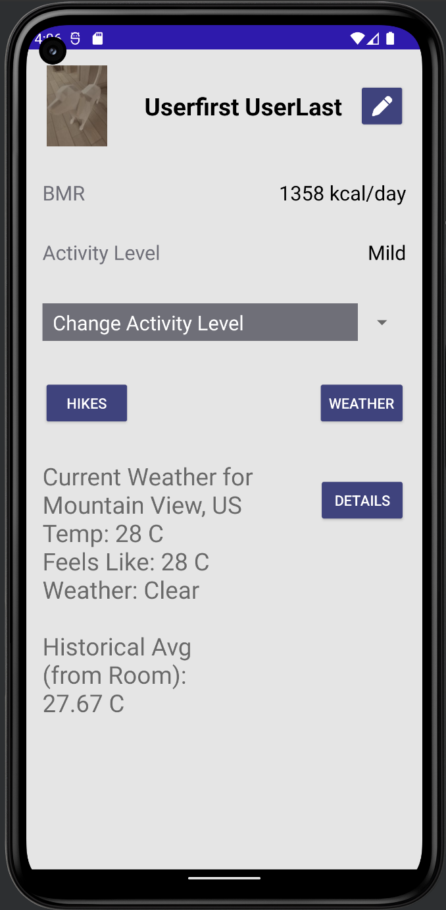
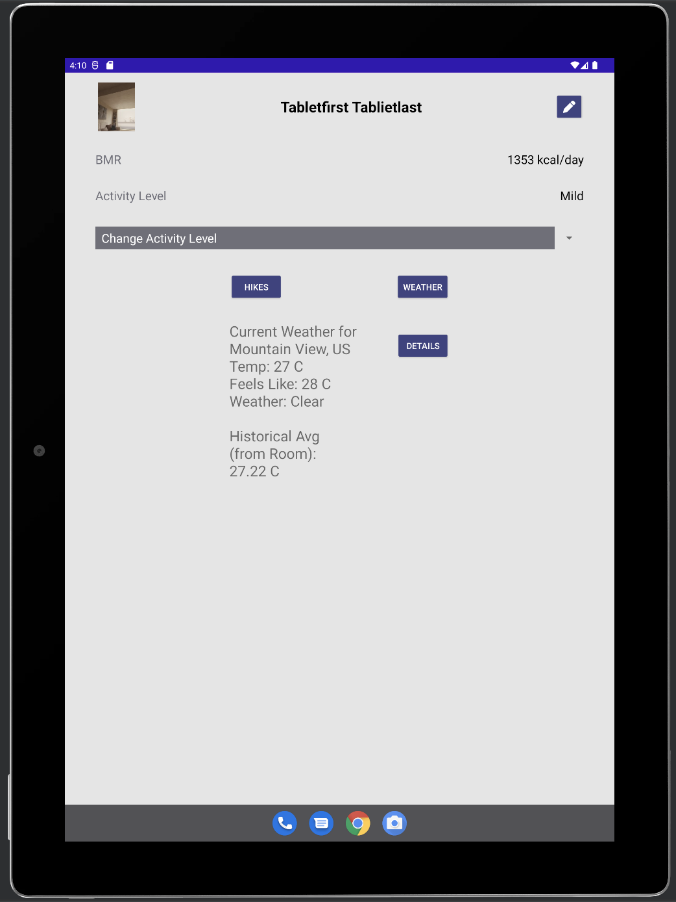
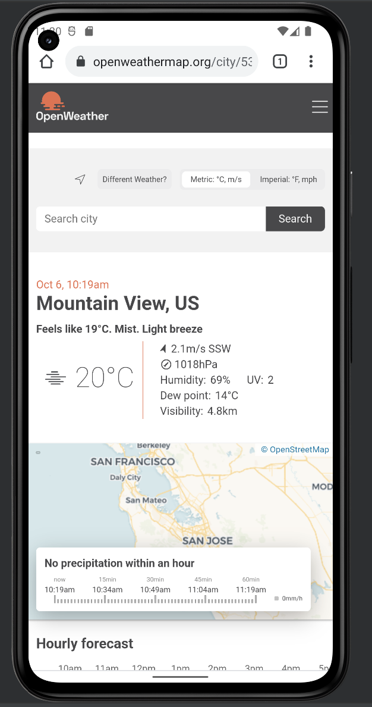
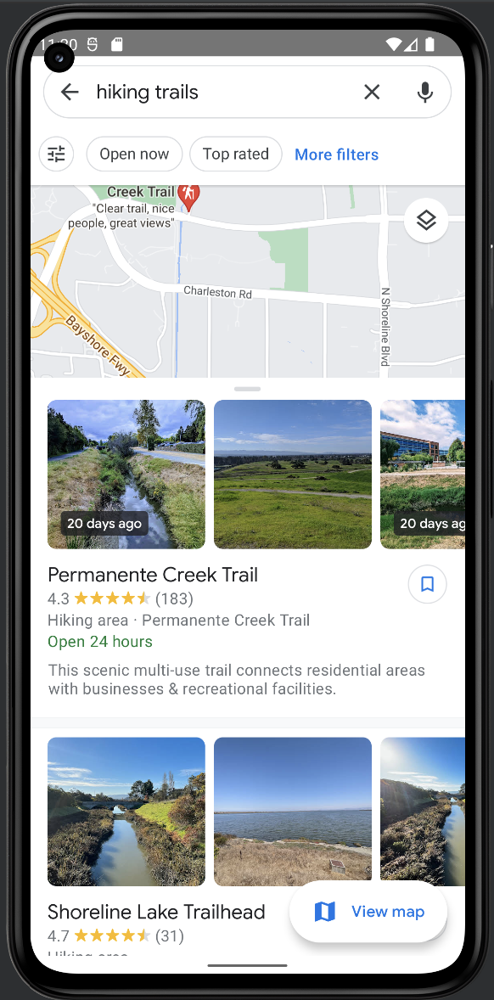
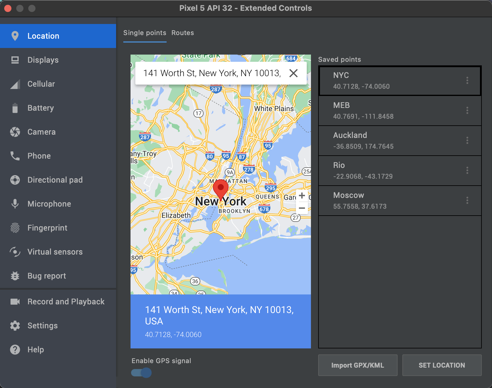

# 6018 MSD project
## Created By: Diego, Jon, Kelan 

### Phase 2 roles:
* Jon - Team lead
* Diego - Design Lead
* Kelan - Test Lead

### Phase 2 meeting notes:

Flow to move data around the app

Tablet mode will be looking at screen width, and in the case that the app is running on a tablet, the view will gravitate towards the centre, and the margins will automagically adjust. This is because of how our app is set up, it doesn't make a lot of sense to rearrange things for tablet view

Room database entry

clean out code from phase 1

implent rotation so that it does not destroy new data

refactor onClick() to contain all listener code pieces

create the MVVM

# Design:

## Register

## Profile

## Update Activity

## Weather Details

## Weather

## Hikes

# Testing

We used five locations in four different quadrants of the planet to test our location detection. MEB and NYC were in the same quadrant. MEB was a good test location to veryify with because of our familiarity with the area, and NYC was chosen because we would know we weren't getting faulty location data from the locality of our machines.

### UI Automator

UI automator was used to run tests on the UI, testing that values exists where expected.

