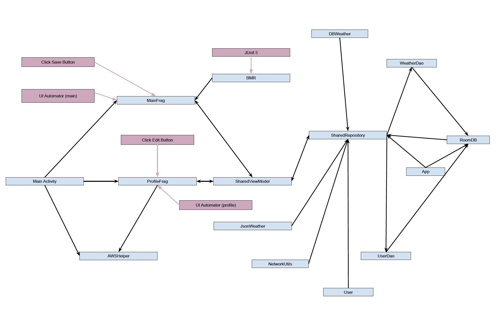
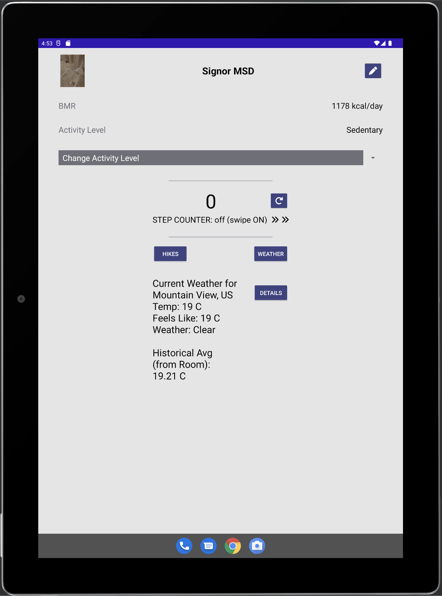

# 6018 MSD project
## Created By: Diego, Jon, Kelan 

### Phase 3 roles:
* Jon - Test lead
* Diego - Team Lead
* Kelan - Design Lead

### Phase 3 meeting notes:

Set up cognito login at the start to allow user chance to not use app if they don't want an app where they need to sign up for a service.

update the database onPause()

No major changes to UI

# Design:

## Class Diagram
### Class diagram overview

## Register

## Profile

## Update Activity

## Weather Details

## Weather

## Hikes

# Testing

We used five locations in four different quadrants of the planet to test our location detection. MEB and NYC were in the same quadrant. MEB was a good test location to veryify with because of our familiarity with the area, and NYC was chosen because we would know we weren't getting faulty location data from the locality of our machines.

### UI Automator

UI automator was used to run tests on the UI, testing that values exists where expected.

### Step testing

Due to limitations in the emulator, we had to use a physical android device to test the step counter.

