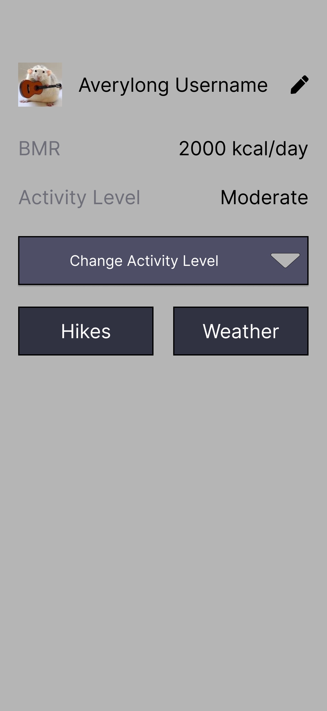
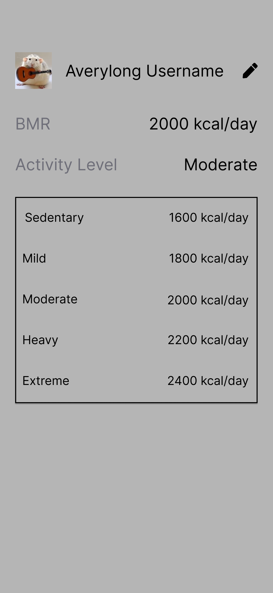
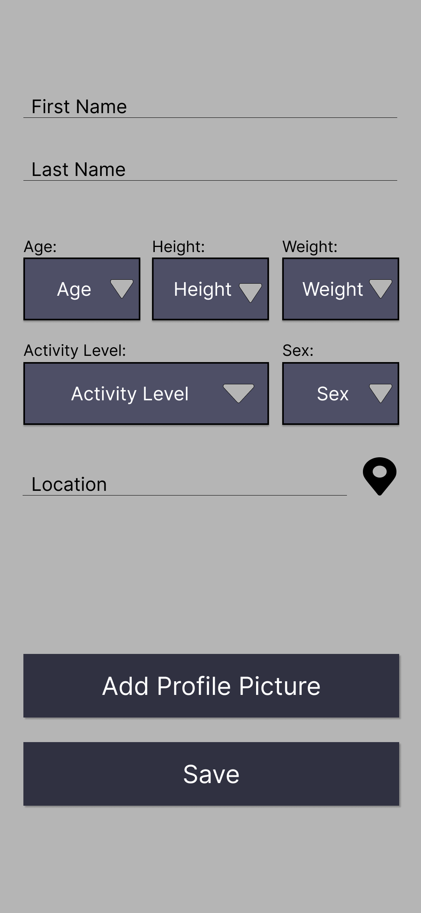

# 6018 MSD project
## Created By: Diego, Jon, Kelan 

### Phase 1 roles:
* Kelan - Team lead
* Jon - Design Lead
* Diego - Test Lead

### Phase 1 meeting notes:
MainActivity will be the homepage with the requested modules 

Will do a check to see if the user profile was already created, and if not it will redirect to the input page

* Only two activities:
	*  Main (homepage) and profile(input/edit)

User will type in ther name, and all other information will be taken as drop-down menus

Activity level will be a dropdown menu, and user will be able to dynamically change their calorie needs based on what they have currently selected

Calorie inout in a drop-down item?

Activity level will be shown in a dropdown menu

Use metric units under the hood for height, weight, basal, etc. We can convert later.

* Stretch goal is to allow for selection between metric and imperial units at profile creation

Implicit intent to switch to google maps and search "hiking trails near {current location}", do the same thing for the weather

Put the profile picture on the left because it is cleaner with the edit button

We he have decided for variable names, we will use the naming convention `typeName`, anf the style of camel case

eg:

* btnHikes, btnWeather

Log.d print is as following: `Log.d("Class", "functionName: message")`

# Design mockups:

Made with figma

## login activity

## Register

 

## Main activity

## Main dropdown open

## Profile

